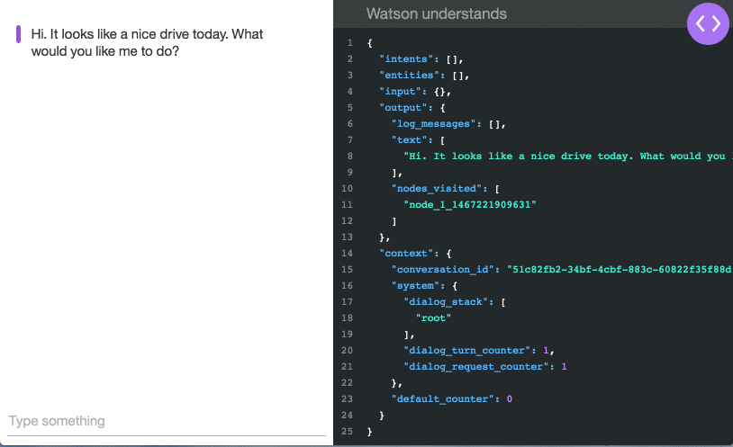

## BizBot 
    This isa simple chatbot using IBMWatson Conversation Assistant to respond some of the user queries.

    e.g.

    1. clone the application
    2. Type `npm start` in cmd window
    3. open browser and type `localhost:3000`
    4. only fewkeywords were programmed 

        a. Type `accounts closed`
           and say `pdf`
        b. Type `accounts closed`
            and say `count`

    
